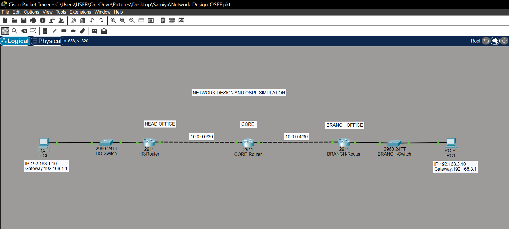

# Network Design and OSPF Routing Simulation

## 📌 Project Overview

Designed and simulated a multi-router network using Cisco Packet Tracer. Connected a Head Office and Branch Office through a Core Router and configured OSPF dynamic routing for communication between networks.

## 🖥️ Network Topology

- 3 Routers
- 2 Switches
- 2 PCs
- IPv4 addressing
- OSPF dynamic routing

## 🌐 IP Addressing

| Device | IP Address |
|---|---|
| PC0 | 192.168.1.10 |
| HQ Router | 192.168.1.1 |
| R1–R2 | 10.0.0.1 / 10.0.0.2 |
| R2–R3 | 10.0.0.5 / 10.0.0.6 |
| Branch Router | 192.168.3.1 |
| PC1 | 192.168.3.10 |

## ⚙️ Technologies

Cisco Packet Tracer • IPv4 • Subnetting • OSPF • Routing & Switching • Network Troubleshooting
## 🧪 Verification

- OSPF neighbor verification
- Routing table verification
- PC-to-PC Ping testing
- Packet flow analysis using Simulation Mode

`show ip ospf neighbor`
`show ip route`
`ping 192.168.3.10`

## 🛠️ Troubleshooting

Tested a wrong default gateway on PC0, identified the issue, and restored the correct gateway 192.168.1.1.

## 📡 Packet Flow

Observed packet movement from PC0 to PC1 using Simple PDU in Simulation Mode.

## 🎯 Learning Outcomes

- Network design
- IPv4 addressing and subnetting
- OSPF dynamic routing
- Routing and switching
- Network troubleshooting
- Cisco Packet Tracer simulation
